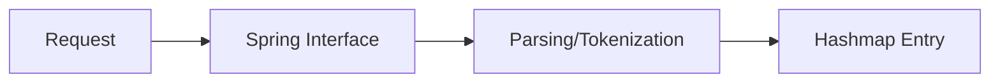

# Search Ranking Engine

<p align="left">
  
  
</p>

## Overview
This is a high performance search ranking engine built with Spring Boot. This project implements the Okapi BM25 ranking function to provide fair scoring, document parsing, tokenization and inverted indexing.

## Core Features
- Tokenization & Normalization: Documents are parsed and converted into tokens to evaluate relevance of each word.
- BM25 Scoring: Fair scoring where shorter concise documents are valued compared to lengthy documents, though there's a lot of other factors to ranking than just document length.
- Optimized selection: The time complexity comes to O(k) where k is the number of documents containg the query terms.

## BM25 Logic
Compared to TF-IDF which only looks at the count of the words, BM25 measures term saturation and document length. The score for a document D given a query Q is calculated as:

### Why this is better:
1. Term Frequency Saturation(k1): This prevents term frequency from dominating the score, eg just because a document contains the word 100 times doesn't mean its 100x more valuable.
2. Length Normalization(b): The penalizes long documents that contain many words but aren't necessarily relevant. This factor is very dependent on the type of documents being parsed because study material even though lengthy is very relevant.

### Document Parsing Architecture


## Tests
To verify the accuracy of the ranker, I have done a simple test including two documents for the query "rank". 
```java
@Test
void shouldCheckForValidRanking() {
    // docs
    Document doc1 = new Document("1", "Test1", "This is a valid rank test. This test is very valid.");
    Document doc2 = new Document("2", "Test2", "Rank aggregation in search engines");
    // add tokens
    List<String> tokens1 = tokenizer.tokenize(doc1.body());
    List<String> tokens2 = tokenizer.tokenize(doc2.body());

    Map<String, Integer> docLengths = Map.of(
            "1", tokens1.size(),
            "2", tokens2.size()
    );
    double avgDocLength = (tokens1.size() + tokens2.size()) / 2.0; // average doc length

    index.add(doc1, tokens1);
    index.add(doc2, tokens2);
    Map<String, Double> scores = ranker.rank(List.of("valid"), index, 2, docLengths, avgDocLength);

    // doc1 should be scored higher as tfCount > doc2 tfCount for query "valid"
    assertTrue(scores.get("1") > scores.get("2"));
}
```

How to the run the tests:
```bash
./mvnw test
```

### Contact
Mayank Joshi - @dirtyyuka - mayankjoshi455@gmail.com
Project link: https://github.com/dirtyyuka/search-ranking-engine
